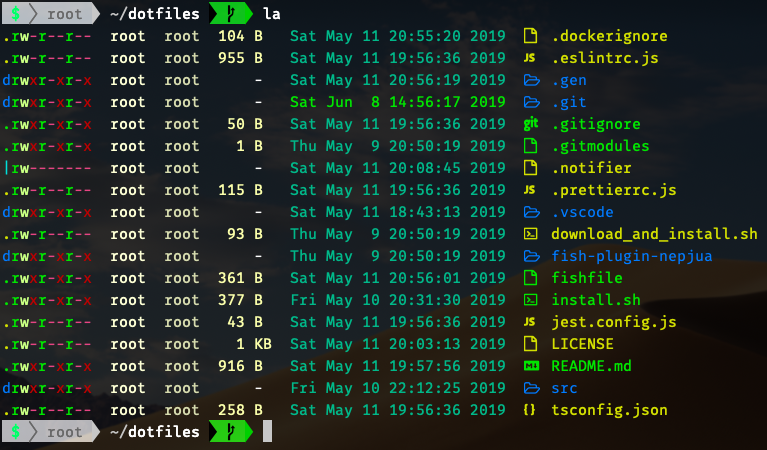

# Dotfiles



### Backup all your current dotfiles, this dotfiles will delete them without any warnings.

> [NerdFonts](https://www.nerdfonts.com/) is required for the icon-fonts in ls to work.

## Demo

You can check out this dotfiles with docker:

```sh
docker run --rm -it yasinuslu/dotfiles
```

## Installation

```sh
git clone https://github.com/yasinuslu/dotfiles.git
cd dotfiles
./install.sh
```

## Usage

We use fish, just run `fish`

### Make fish your default shell

- In POSIX compliant shells like `bash` or `zsh`

  ```sh
  chsh -s $(which fish)
  ```

- In `fish`

  ```sh
  chsh -s (which fish)
  ```

## Troubleshooting

### Can not copy the text from tmux

If you're on Mac OS, chances are you might be missing this package:

```
brew install reattach-to-user-namespace
```

Also would be helpful to see [this post](https://medium.com/@bramblexu/enable-tmux-copy-paste-in-vs-code-terminal-for-mac-408a5cf94cd9)

## References

- [https://github.com/gpakosz/.tmux](https://github.com/gpakosz/.tmux)
- [https://github.com/junegunn/fzf](https://github.com/junegunn/fzf)
- [https://github.com/SpaceVim/SpaceVim](https://github.com/SpaceVim/SpaceVim)
- [https://github.com/icy/pacapt](https://github.com/icy/pacapt)
- [https://github.com/asdf-vm/asdf](https://github.com/asdf-vm/asdf)
